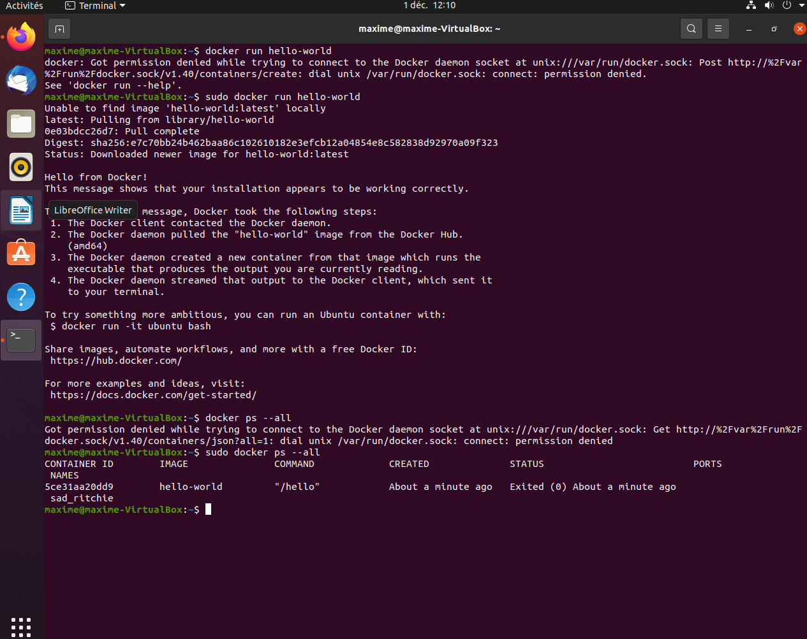

# Commandes Docker

- Docker run permet de lancer un conteneur a partir d'une image
- Docker exec lance une commande dans un conteneur
- Docker build permet de créer une image a partir d'un fichier Dockerfile

# Hello World

