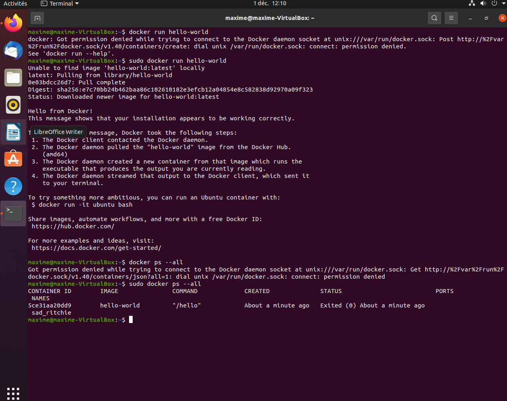

# Commandes Docker

- Docker run permet de lancer un conteneur a partir d'une image
- Docker exec lance une commande dans un conteneur
- Docker build permet de créer une image a partir d'un fichier Dockerfile

# Hello World

# Run an image

- Pour run une image il faut:
- - build l'image avec la commande : sudo docker build . -t image1
- - récupérer l'id de l'image avec : sudo docker images
- - run l'image avec : sudo docker run --name flask -p 5000:5000 [id]
- - pour delete toutes les images : sudo docker system prune