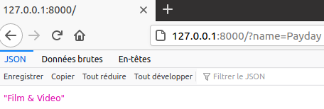
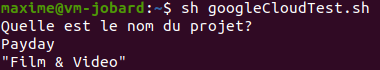

# Deviner la catégorie d'un projet KickStarter

## Objectif

Le projet a pour but d'expérimenter avec le word2vect en essayant de deviner de quelle catégorie provient un projet à partir de son nom.

## Fonctionnement

notebook.ipynd:

- Création du fichier algo.joblib qui sert de référence pour le fonctionnement de l'API

EDA.ipynb:

- Tentative de création d'une version orientée objet pour générer algo.joblib

algo.joblib:

- Données de référence pour deviner la catégorie d'un projet

main.py:

- API qui sert d'interface utilisateur pour deviner la catégorie d'un projet

Dockerfile:

- Dockerisation de main.py afin de pouvoir le déployer sur ma VM Google Cloud

## Utilisation depuis un navigateur

Route : 0.0.0.0:5000/?name=TEST

La variable du nom du projet doit être après name dans l'URL et retourne un string avec la catégorie du projet prédis par l'algorithme.

Ex:

## Utilisation depuis une VM google cloud

Depuis la racine de la VM 34.122.220.115, utiliser la commande sh googleCloudTest.sh et donner le nom du projet après le prompt

Sinon, la commande curl 0.0.0.0:5000/?name=TEST pour faire la requête directement

Ex:

